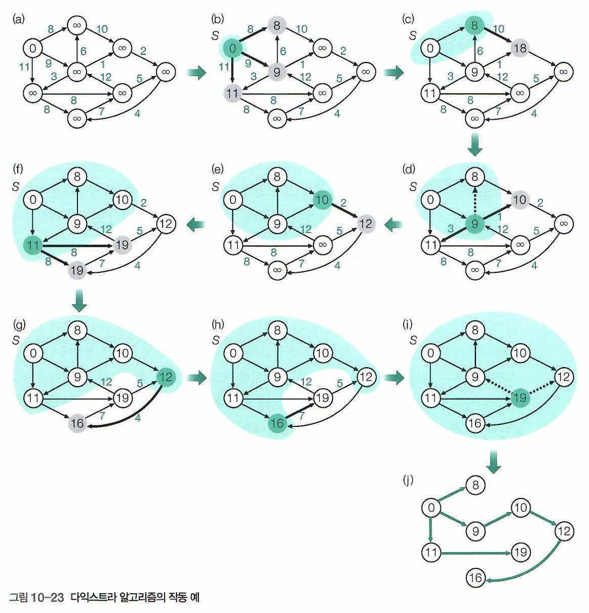

# 다익스트라(Dijkstra) 알고리즘

1. 개요

   * 음의 간선이 없는 그래프에서 특정 하나의 정점에서 모든 다른 정점으로 가는 최단거리를 구하는 알고리즘.
2. 알고리즘

   1. 출발 노드를 설정한다.
   2. 각 노드의 비용을 무한대로 한다.
   3. 출발 노드를 기준으로 각 노드의 최소 비용을 저장한다.
   4. 방문하지 않은 노드 중에서 가장 비용이 적은 노드를 선택한다.
   5. 해당 노드를 거쳐서 특정한 노드로 가는 경우를 고려하여 최소 비용을 갱신한다.
   6. 3 - 4를 반복한다.
3. 주의사항

   * 가장 비용이 적은 노드 선택 시 우선순위 큐를 이용하여 최적화 가능.
   * 큐에 노드 삽입 시 현재 노드의 이동 비용과 현재 간선의 비용과 바로 비교하여 중복 삽입 방지(현재 간선의 비용이 더 클 때, 반복문의 시작점으로).
4. 의사 코드

5. 참고 그림

   
6. 관련 코딩테스트 문제

   [백준 최소비용 구하기(1916)](https://www.acmicpc.net/problem/1916) 
   [프로그래머스 배달(12978)](https://school.programmers.co.kr/learn/courses/30/lessons/12978)
